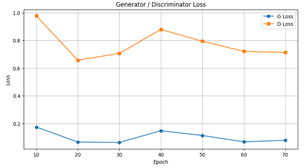
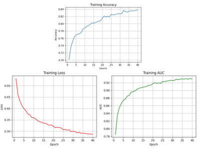

# 딥러닝 기반 스테가노그래피 생성 및 판별 시스템
### (Deep Learning-Based Steganography Generation and Detection System)

## 📖 프로젝트 개요 (Abstract)
본 프로젝트는 **GAN(Generative Adversarial Network)** 기반의 이미지 정보 은닉 시스템과 **CNN(Convolutional Neural Network)** 기반의 은닉 여부 탐지 시스템을 통합한 솔루션입니다. 
기존 스테가노그래피 기술의 한계를 넘어, 딥러닝을 통해 육안으로 식별 불가능한 고화질 스테고 이미지(Stego Image)를 생성하고, 이를 높은 정확도로 판별할 수 있습니다.

> **성과:** 본 연구는 **대한전기학회(KIEE) 학술대회**에 논문으로 출간되었습니다.

---

## 🛠 시스템 아키텍처 (System Architecture)
본 시스템은 크게 생성(Generation)과 판별(Detection), 그리고 이를 통합한 GUI 프로그램으로 구성됩니다.

### 1. 스테가노그래피 생성 모델 (Generator)
* **모델 구조:** U-Net 기반 생성자 + **CBAM(Convolutional Block Attention Module)** 적용
* **기능:** 512x512 해상도의 원본 이미지에 16자의 텍스트 데이터를 자연스럽게 은닉
* **알고리즘:** 생성자(Generator)와 판별자(Discriminator)의 적대적 학습(GAN)을 통해 원본과 유사한 화질 구현

### 2. 스테가노그래피 판별 모델 (Detector)
* **모델 구조:** **ResNet-18** 기반의 CNN 분류기
* **기능:** 입력된 이미지가 일반(Clean) 이미지인지, 데이터가 숨겨진(Stego) 이미지인지 판별
* **최적화:** Adam Optimizer 및 손실 함수 최적화를 통한 학습 안정성 확보

### 3. 통합 GUI 프로그램
* **프레임워크:** PyQt5
* **주요 기능:**
    * Clean Image 업로드 및 텍스트(16자) 입력 시 Stego Image 자동 생성 및 저장
    * 이미지 업로드 시 실시간 스테가노그래피 포함 여부 판별 (Clean/Stego)

---

## 📊 연구 결과 및 성능 (Performance)
**Kaggle Stego Image Dataset** (Clean 8,000장 / Stego 6,000장)을 사용하여 검증한 결과입니다.

### 1. 생성 품질 (Image Quality)
육안으로는 원본과 구분이 불가능한 수준의 고품질 이미지를 생성했습니다.
* **PSNR:** 31.81 dB
* **SSIM:** 0.9760
* **Loss:** G Loss 0.0669 / D Loss 0.7214

 

### 2. 판별 정확도 (Detection Accuracy)
* **Accuracy:** 83.8% 
* **AUC:** 0.92
* **Loss:** 0.29 

---
## 👨‍💻 Contributors (참여자)
본 프로젝트는 **상명대학교 정보보안공학과** 캡스톤 디자인 팀 프로젝트로 진행되었습니다.

### 👩‍💻 Team Members (개발 팀원)
* **곽지현 (Me)** - [its.jihyeon@gmail.com]
* **안지수**
* **고가은**

### 🎓 Advisor (지도교수)
* **박진성 교수님**
